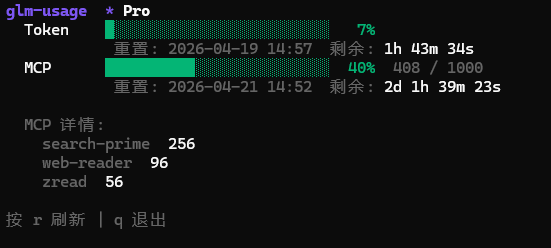
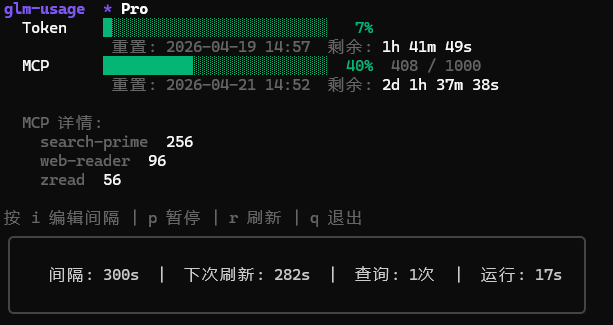

# glm-usage

CLI API 用量监控工具 — 查询、监控智谱 AI API 用量限额。

## 功能

| 命令 | 功能 |
|------|------|
| `glm-usage` | 单次查询当前用量（TUI 界面） |
| `glm-usage -w` | 持续监控模式（TUI 界面） |
| `glm-usage config` | 配置管理：设置 API Key、显示配置路径 |
| `glm-usage status` | 配置诊断：显示配置信息、API 连接测试、用量概览 |
| `glm-usage version` | 显示版本信息 |

## 界面预览

**单次查询**



**持续监控**



## 安装

```bash
go build -o glm-usage
```

## 快速开始

```bash
# 首次运行会交互式引导设置 API Key
./glm-usage

# 或手动设置
./glm-usage config api-key "your-api-key"
./glm-usage
```

## 命令详情

### 查询用量（根命令）

```bash
./glm-usage                # 单次查询（TUI 界面）
./glm-usage -w             # 持续监控模式
./glm-usage -w -i 60       # 60秒刷新一次
./glm-usage -o json        # JSON 格式输出
./glm-usage -o plain       # 纯文本输出
./glm-usage -w -o plain    # 持续监控 + 纯文本
```

TUI 模式下：
- **`r`** 手动刷新
- **`q`** 退出

持续监控模式下额外支持：
- **`i`** 弹出输入框，动态修改刷新间隔（5-86400 秒），Enter 确认，Esc 取消
- **`p` / 空格** 暂停/继续监控
- **`r`** 立即刷新
- **`q`** 退出

状态栏实时显示：当前间隔、下次刷新倒计时、查询次数、运行时长。

输出格式：
- **table**（默认）：TUI 界面，彩色进度条、实时倒计时
- **json / yaml / plain**：纯文本输出，适合管道和脚本

### config — 配置管理

```bash
./glm-usage config api-key           # 交互式输入 API Key
./glm-usage config api-key xxx       # 直接设置 API Key
./glm-usage config path              # 显示配置文件路径
```

### status — 状态诊断

```bash
./glm-usage status
```

显示配置信息、API Key（脱敏）、连接测试延迟、当前用量概览。

### version — 版本信息

```bash
./glm-usage version
```

## 全局参数

| 参数 | 说明 |
|------|------|
| `--config` | 指定配置文件路径 |
| `--output` / `-o` | 输出格式：`table` / `json` / `yaml` / `plain` |
| `--api-key` | 临时指定 API Key（覆盖配置） |
| `--verbose` / `-v` | 详细日志输出（Debug 级别） |
| `--watch` / `-w` | 持续监控模式 |
| `--interval` / `-i` | 刷新间隔（秒，默认 300） |

## 配置文件

默认路径：`~/.cicbyte/glm-usage/config/config.yaml`

```yaml
api_key: ""
```

## 错误处理

| 退出码 | 说明 |
|--------|------|
| 0 | 成功 |
| 1 | API 认证失败 |
| 2 | 请求超时 |
| 3 | 配置初始化失败 |
| 4 | 无效参数 |
| 5 | 网络错误 |
| 9 | 未知错误 |

## 依赖

- Go 1.24+
- [Cobra](https://github.com/spf13/cobra) — CLI 框架
- [Bubble Tea](https://github.com/charmbracelet/bubbletea) — TUI 框架
- [Lip Gloss](https://github.com/charmbracelet/lipgloss) — 样式
- [Bubbles](https://github.com/charmbracelet/bubbles) — Spinner / TextInput
- [Zap](https://github.com/uber-go/zap) — 日志

## License

MIT
