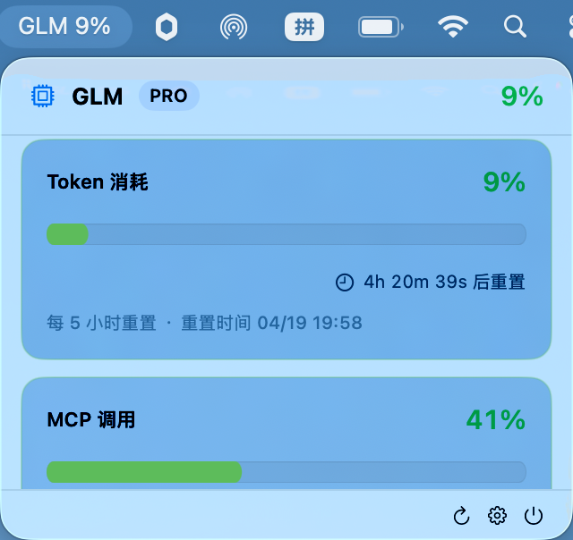

# CPlusage

macOS 菜单栏应用，用于监控 AI 编码平台的使用量配额。



## 功能

- 实时显示 Token 消耗百分比与 MCP 调用量
- 动态倒计时显示配额重置时间
- 支持多服务器端点（open.bigmodel.cn / api.z.ai）
- 自动定时刷新（1 / 5 / 15 / 30 分钟可选）
- 用量阈值通知（警告 / 危险）
- API Key 安全存储于 Keychain

## 支持平台

| 平台 | 状态 |
|------|------|
| GLM（智谱 AI） | 已支持 |

## 系统要求

- macOS 26.0+
- Xcode 26+
- Swift 5

## 构建

```bash
git clone <repo-url> cplusage
cd cplusage
xcodebuild -project cplusage.xcodeproj -scheme cplusage -configuration Release build
```

或直接用 Xcode 打开 `cplusage.xcodeproj`，选择 scheme `cplusage` 后 Build & Run。

## 使用

1. 启动后在菜单栏出现 "GLM" 图标及百分比
2. 点击图标展开面板，点击底部齿轮图标打开设置
3. 填入 API Key 并保存，数据自动加载

## 项目结构

```
cplusage/
├── cplusageApp.swift          # App 入口，MenuBarExtra + 设置窗口管理
├── Core/
│   ├── Models/
│   │   ├── UsageModels.swift  # 通用用量模型（UsageSnapshot, UsageDetail）
│   │   └── GLMModels.swift    # GLM API 响应模型
│   ├── Providers/
│   │   ├── ProviderProtocol.swift  # Provider 协议
│   │   └── GLMProvider.swift       # GLM 实现
│   └── Services/
│       ├── APIService.swift         # HTTP 客户端（含重试）
│       ├── ConfigService.swift      # UserDefaults 配置管理
│       ├── KeychainService.swift    # Keychain 存取
│       └── NotificationService.swift # 本地通知
├── Storage/
│   ├── AppState.swift        # 全局状态，刷新调度，阈值检测
│   └── HistoryManager.swift  # 用量历史（7 天保留）
├── UI/
│   ├── MenuBar/
│   │   └── ContentView.swift # 菜单栏下拉面板
│   ├── Components/
│   │   ├── UsageGauge.swift      # 进度条卡片（含动态倒计时）
│   │   └── UsageDetailView.swift # MCP 工具调用详情
│   └── Settings/
│       └── SettingsView.swift    # 设置窗口
├── Utils/
│   ├── Constants.swift       # 常量定义
│   └── Formatters.swift      # 格式化工具
└── cplusage.entitlements     # 沙箱权限
```

## 架构

采用 Provider 模式，通过 `Provider` 协议抽象不同 AI 平台的用量接口。新增平台只需：

1. 在 `Core/Models/` 添加平台 API 模型
2. 在 `Core/Providers/` 实现 `Provider` 协议
3. 在 `AppState` 中注册新 Provider

## 配置项

| 配置 | 默认值 | 说明 |
|------|--------|------|
| 刷新间隔 | 5 分钟 | 自动拉取用量数据的频率 |
| 启动时自动刷新 | 开启 | 应用启动后立即获取数据 |
| 警告阈值 | 80% | 触发警告通知 |
| 危险阈值 | 90% | 触发紧急通知 |
| 通知 | 开启 | 是否发送系统通知 |

## 许可

MIT
