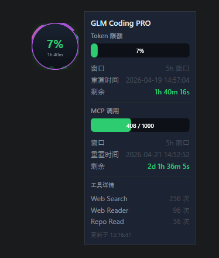

# GLM Usage

GLM API 用量监控悬浮球，实时显示 Token 和 MCP 工具调用配额使用情况。

## 界面预览



## 功能

- **悬浮球** — 桌面悬浮显示用量百分比，颜色随用量变化（绿 → 黄 → 红），支持拖拽定位
- **水位动画** — 球内波浪填充动画，直观展示用量比例
- **详情面板** — 点击悬浮球展开，显示 Token 和 MCP 用量详情及倒计时
- **系统托盘** — 最小化到托盘，右键菜单快捷操作，用量警告气泡通知
- **自动刷新** — 可配置刷新间隔（3秒 ~ 2分钟）
- **开机自启** — 可选开机自动启动
- **暗色主题** — 现代深色 UI 风格

## 安装

Git 仓库未包含编译产物，需先自行构建：

```bash
# 1. 运行 publish.bat 编译（需要 .NET 8 SDK）
publish.bat

# 2. 可选：打包为安装程序（需要 Inno Setup 6）
ISCC.exe installer.iss
```

直接运行 `publish\GLMUsage.exe` 即可，或使用生成的 `installer\GLMUsage-Setup-1.0.0.exe` 安装。

需要 [.NET 8 Desktop Runtime](https://dotnet.microsoft.com/download/dotnet/8.0)。

## 首次使用

1. 启动后输入 GLM API Key
2. 悬浮球自动显示用量信息
3. 点击悬浮球查看详情
4. 右键悬浮球或托盘图标打开设置

## 构建

详见 [BUILD.md](BUILD.md)。

## 技术栈

- WPF / C# / .NET 8
- 纯 Win32 API 实现系统托盘
